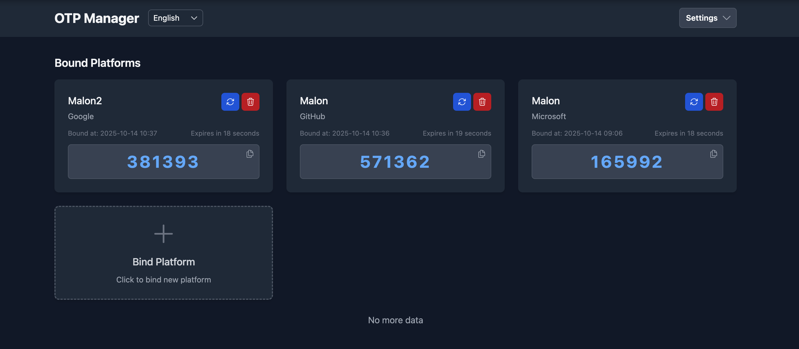

# OTP Manager

A full-stack application for managing One-Time Password (OTP) across multiple platforms. The system consists of a NestJS backend API and a React frontend interface with internationalization support.

## 🌟 Features

- **User Authentication**
    - Secure JWT-based authentication
    - Registration and login with OTP support (using TOTP)
    - Password management and change functionality
- **Platform Management**
    - Create and manage authentication platforms
    - Associate user accounts with platforms
- **Internationalization**
    - Multi-language support (English, Simplified Chinese, Traditional Chinese)
    - Language switching capability
- **Modern UI**
    - Responsive dashboard interface
    - Theme support

## 🛠 Tech Stack

### Backend (apps/api)
- **Framework**: NestJS 11
- **Database**: Prisma ORM with PostgreSQL
- **Authentication**: JWT, Passport.js, speakeasy (OTP)
- **Validation**: class-validator, class-transformer
- **Testing**: Jest, Supertest
- **Other**: i18n, Helmet security headers

### Frontend (apps/web)
- **Framework**: React 19
- **State Management**: Zustand
- **Styling**: Tailwind CSS, Headless UI
- **Routing**: React Router 7
- **i18n**: i18next
- **HTTP Client**: Axios
- **Build Tool**: Vite

### Shared
- TypeScript
- Monorepo structure (pnpm workspace)
- ESLint + Prettier
- Jest for testing

## 🚀 Installation

### Prerequisites
- Node.js v22+
- pnpm v10+
- PostgreSQL database

### Setup
1. Install dependencies:
```bash
pnpm install
```

2. Set up environment variables:
```bash
cp apps/api/.env.example apps/api/.env
# Edit .env with your database connection
```

3. Run database migrations:
```bash
cd apps/api && npx prisma migrate deploy
```

4. Execute seed data population:
```bash
cd apps/api && npx prisma db seed
```

## 🏃‍♂️ Running the Application

Start both services in separate terminals:

```bash
# Backend API
pnpm --filter @otp-manager/api dev

# Frontend
pnpm --filter @otp-manager/web dev
```

The application will be available at:
- API: `http://localhost:3000`
- Web: `http://localhost:5173`

Default account credentials: `admin@example.com` / `admin123`

## 🧪 Testing

Run tests for specific applications:

```bash
# Backend tests
pnpm --filter @otp-manager/api test

# Frontend tests
pnpm --filter @otp-manager/web test
```

## 🤝 Contributing

Contributions are welcome! Please follow these steps:
1. Fork the repository
2. Create your feature branch (`git checkout -b feature/AmazingFeature`)
3. Commit your changes (`git commit -m 'Add some AmazingFeature'`)
4. Push to the branch (`git push origin feature/AmazingFeature`)
5. Open a Pull Request

## 📄 License

This project is licensed under the MIT License - see the [LICENSE](LICENSE) file for details.